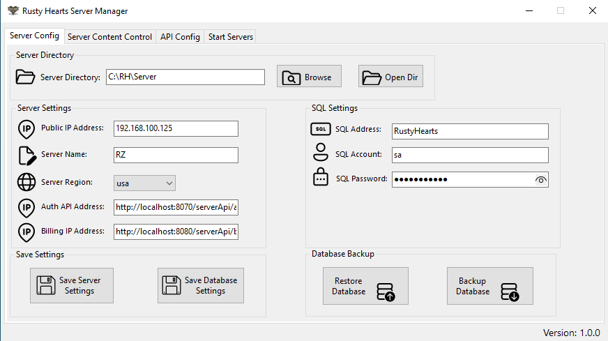
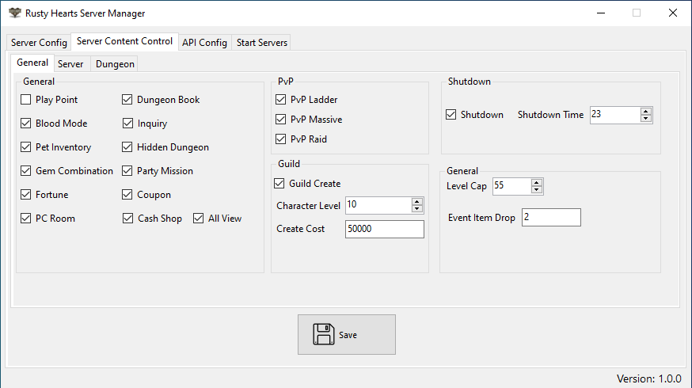
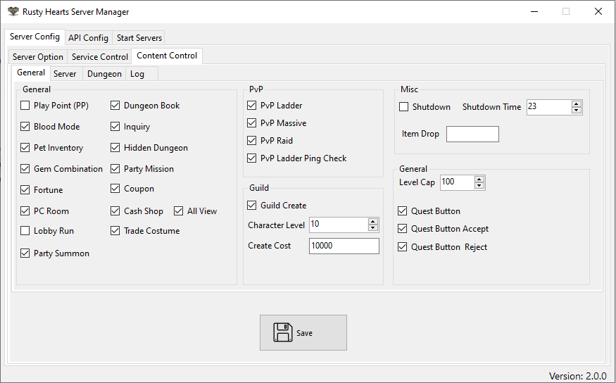
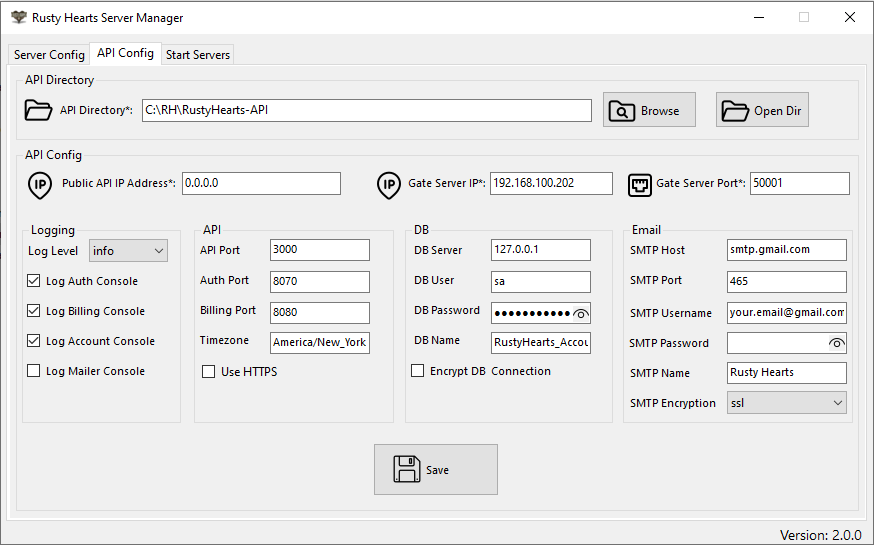
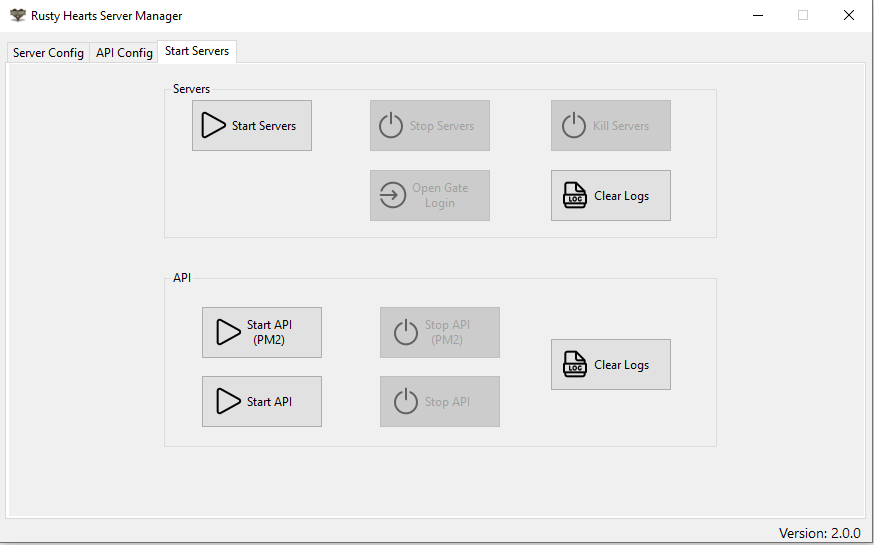

# Rusty Hearts Server Manager

 <a href="https://github.com/JuniorDark/RustyHearts-Server-Manager/releases">

A C# Windows Forms application designed to simplify the configuration and management of Rusty Hearts game servers. This tool provides an intuitive way to modify and manage various server/api parameters and start the servers with ease.

## Getting Started

To get started with this tool, simply download the latest release from the GitHub repository.

## Features

- **Server Configuration:** Easily configure various server settings such as player limits, level cap, and more.
- **API Configuration:** Configure the [Rusty Hearts API](https://github.com/JuniorDark/RustyHearts-API) settings, including authentication credentials, endpoint URLs, and settings.
- **Server Startup:** Start the servers/API with a single button, ensuring that the configured settings are applied correctly.
- **Backup and Restore:** Create backups of the databses and restore them when needed.

## Preview

## Prerequisites for Building Locally/Development
The tool is built in .NET 7 and as such, the packages listed below are required to create a local and development build of the launcher. Furthermore, it uses many submodules and packages outside of this, which will automatically be loaded when the user sets up a local environment of the application.
* Visual Studio 2022 (Any Edition - 17.4 or later)
* Windows 10 SDK (10.0.19043.0) or Windows 11 SDK (10.0.22000.0) via Visual Studio Installer
* .NET: [.NET Core 7 SDK (7.0.100 or later)](https://dotnet.microsoft.com/en-us/download/dotnet/7.0)

## System Requirements for Ready-to-use build
* OS: Windows 10 1809 Update (build 17763) or later / Windows 11 (Any builds)
* Architecture: x64/AMD64

## License
This project is licensed under the terms found in [`LICENSE-0BSD`](LICENSE).

## Contributing
Contributions from the community are welcome! If you encounter a bug or have a feature request, please submit an issue on GitHub. If you would like to contribute code, please fork the repository and submit a pull request.

## FAQ
* Q: How do I report a bug?
  * A: Please submit an issue on GitHub with a detailed description of the bug and steps to reproduce it.
* Q: How do I request a new feature?
  * A: Please submit an issue on GitHub with a detailed description of the feature and why it would be useful.
* Q: How do I contribute code?
  * A: Please fork the repository, make your changes, and submit a pull request.

## Credits
The following third-party libraries, tools, and resources are used in this project:
* [System.Data.SqlClient](https://www.nuget.org/packages/System.Data.SqlClient)

## Support
If you need help with the tool, please submit an issue on GitHub.
